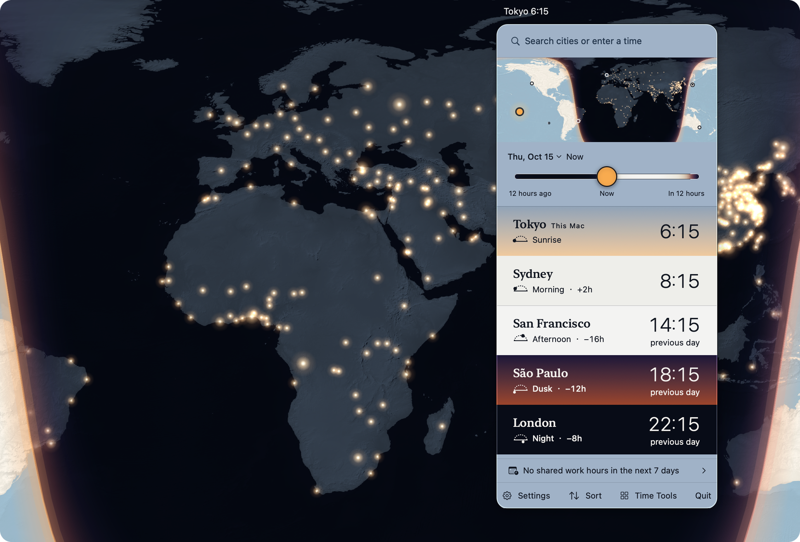

# Dayside

English · [简体中文](README.zh-Hans.md)

Before you message someone in Tokyo, look at their sky.



Dayside is a world clock for the Mac menu bar. Every place you add gets a row, and the row is
painted in the real color of its sky at this moment: dark at night, bright in the daytime,
a little rose at dawn and amber at dusk. You can tell at a glance who is asleep.

Talking across time zones has too many problems that come up again and again. I made Dayside to
solve them in one place: the time difference, whether someone is awake, how to set a meeting
without making someone stay up late, and when daylight saving will change.

## What it looks like

Click the clock in the menu bar and a panel opens. At the top is a world map with the half of
the Earth that the sun lights right now, and the line between day and night. Under it, each of
your places has its row of sky, its local time and how far ahead or behind you it is. There is
a search field that also understands natural language like "tomorrow 9:00 Tokyo".

Time can be shifted: drag the map or the time slider, and the sun, the day-and-night line
and every clock move together. Double-click the map to open the Earth window: a big map with
your places and their local times, and the lights of cities on the night side (only cities
with a large enough population get lights). It can go full screen.

The app has no Dock icon. It lives in the menu bar.

## What you can do with it

- Show one to six clocks in the menu bar, with place names, abbreviations or UTC offsets.
- Search cities offline. The search knows local names in many languages, short city names like
  NYC or HK, country names like UK, and time zone offsets. Sunrise and sunset use each city's own coordinates.
- Dates, times, places and time zones written in 16 languages: Dayside can find them in a whole
  block of text. Paste a chat message or an email. When a time can be read two ways, it shows
  both and lets you pick. When a time cannot be real, it says so.
- Find a meeting time that works for everyone. For a regular meeting, Dayside can rotate the
  bad hours, so the same people do not always stay up late. Then add it to your calendar.
- Use the other pages in the Time Tools window: Calendar, People, Time Conversion, Timers,
  Daylight Saving Alerts, Sun and Moon, Market Clock, Travel and Share My Time. Each page loads only when you open it.
- Use it from Shortcuts, Spotlight, the Services menu ("Convert Time with Dayside") or a global shortcut (off by default).

The time reading runs entirely on your Mac with fixed rules written in Rust. The same text
always gives the same answer (no guessing). For the hour that daylight saving skips or
repeats, Dayside uses the system's own time zone rules.

The 16 interface languages are English, Simplified Chinese, Traditional Chinese, Japanese,
Korean, German, Spanish, French, Russian, Portuguese, Italian, Dutch, Polish, Turkish,
Vietnamese and Indonesian. City names can use a different language from the interface.

## Install

Dayside needs macOS 26 or later. There are two disk images on the [Releases](https://github.com/ninondev/Dayside/releases) page:

- The file ending in `-arm64.dmg` is for Macs with Apple silicon.
- The file ending in `-x86_64.dmg` is for Intel Macs. I have checked it only under Rosetta on an
  Apple silicon Mac, not on a real Intel Mac. If your Mac has Apple silicon, you must use the arm64 one.

Open the disk image and drag Dayside.app to Applications.

The app is signed ad hoc and is not notarized, so macOS blocks it the first time you open it.
To open it, go to System Settings › Privacy & Security, scroll to the bottom, click
"Open Anyway" and confirm with your password.

You can find the version number in the app under Settings › Help.

## Privacy

Dayside has no account, no telemetry and no ads. The release build has no network permission,
and the app makes no network requests of its own. When you click a web link, it opens in
another app, and that app may go online.

Your places, settings and saved records stay on your Mac. Dayside reads your calendars or
contacts only after you allow it, and it does not change your contacts. The diagnostic log and
crash reports stay local too. You can export a diagnostic report yourself; please read it before
you share it, because it includes your saved places.

To report a security or privacy problem, see [SECURITY.md](SECURITY.md).

## Build from source

You need macOS 26 or later, Xcode 27, Rust 1.85 or later, Python 3 and the Rust Apple targets for
the architectures you build. Cargo dependencies are pinned in `RustCore/Cargo.lock`. The commands
below run offline, so those dependencies must already be in your local Cargo cache.

From `RustCore/`, run:

```sh
cargo test --locked --offline -j 3 --all-targets
cargo test --locked --offline -j 3 --release --lib
cargo test --locked --offline -j 3 --lib --features intents-only
cargo clippy --locked --offline -j 3 --all-targets -- -D warnings
```

From the repository root, check the license headers, localization catalogs and sharing page:

```sh
python3 Tools/spdx_headers.py --check
python3 Tools/l10n_check.py --check
node Tools/site_tests/when_test.mjs
```

The localization check covers source references and all 16 translations without a build. When
compiler-extracted strings are available, it checks those too and reports that scope. Node is
needed only for the sharing-page tests.

To compile the Mac app and its test bundle without running it, set `DAYSIDE_DERIVED_DATA` to a
build-output directory, then run from the repository root:

```sh
xcodebuild -project Dayside.xcodeproj -scheme Dayside -configuration Debug \
  -destination 'platform=macOS,arch=arm64' -derivedDataPath "$DAYSIDE_DERIVED_DATA" \
  -jobs 3 CODE_SIGNING_ALLOWED=NO build-for-testing
```

`DaysideCore` runs `Tools/build_rust_core.sh` to create the Rust static library before compiling
Swift. `Tools/sign_bundle.sh` signs local builds ad hoc, so you do not need a developer account. Published releases are re-signed with a Developer ID and notarized by `Tools/release_sign_notarize.sh`.
`Tools/verify_all.sh` also runs the Swift tests, which launch the app as their host. A build that
succeeds does not show that the Swift tests or the app's interactions pass.

Where things are:

- `RustCore/`: rules, the city index, search, time reading, astronomy, planning, drawing geometry
  and saved data. See [RustCore/README.md](RustCore/README.md).
- `Dayside/` and `Shared/`: SwiftUI views and Apple framework code.
- `DaysideTests/`, `DaysideUITests/` and `RustCore/tests/`: tests and their fixtures.
- `DaysideiOS/`: an iPhone prototype that shares the Rust core, with fewer features.
- `Tools/`: build, test, packaging, measurement and data tools.
- `site/`: the page for shared time cards, and draft privacy and support pages.

## Place names

City and administrative names come from GeoNames and Wikidata. Missing translations fall back
to the recorded name.

## Known issues

1. The translations have not been read by native speakers yet. Corrections are welcome.
2. Automated accessibility checks pass on every page. A full hands-on VoiceOver walkthrough has not been done yet.
3. Market Clock includes the official 2026 holiday closures for Shanghai and Hong Kong. Other years follow general rules that can miss a bridging holiday. Half-day sessions are not shown.
4. The Earth window and a few pages use somewhat more memory than before. Making them lighter is planned for 1.0.1.
5. Time zone rules come from macOS. Dayside warns when this Mac's data is older than known rule changes.

Feedback goes to [GitHub Issues](https://github.com/ninondev/Dayside/issues).

## License

Dayside is free software under GPL-3.0-only. Every feature is free, and Dayside will never be
sold. See [LICENSE](LICENSE) and [COPYING](COPYING).

## Data sources and credits

- City data: [GeoNames](https://www.geonames.org), CC BY 4.0.
- Place-name labels: [Wikidata](https://www.wikidata.org), CC0.
- Map relief: [Natural Earth](https://www.naturalearthdata.com), public domain.
- Time zone rules: the IANA Time Zone Database that ships with macOS, read at run time.
- Day-period words: Unicode CLDR, Unicode License v3.
- The brush calligraphy on the Chinese welcome screen is made from glyph outlines of
  Liu Jian Mao Cao, SIL Open Font License 1.1. The epigraph lines are from Zhang Jiuling
  (Tang dynasty) and John Muir.

[THIRD_PARTY_NOTICES.md](THIRD_PARTY_NOTICES.md) has the details, and
`Dayside/Resources/ThirdPartyNotices.txt` has the notices for the bundled Rust crates.
