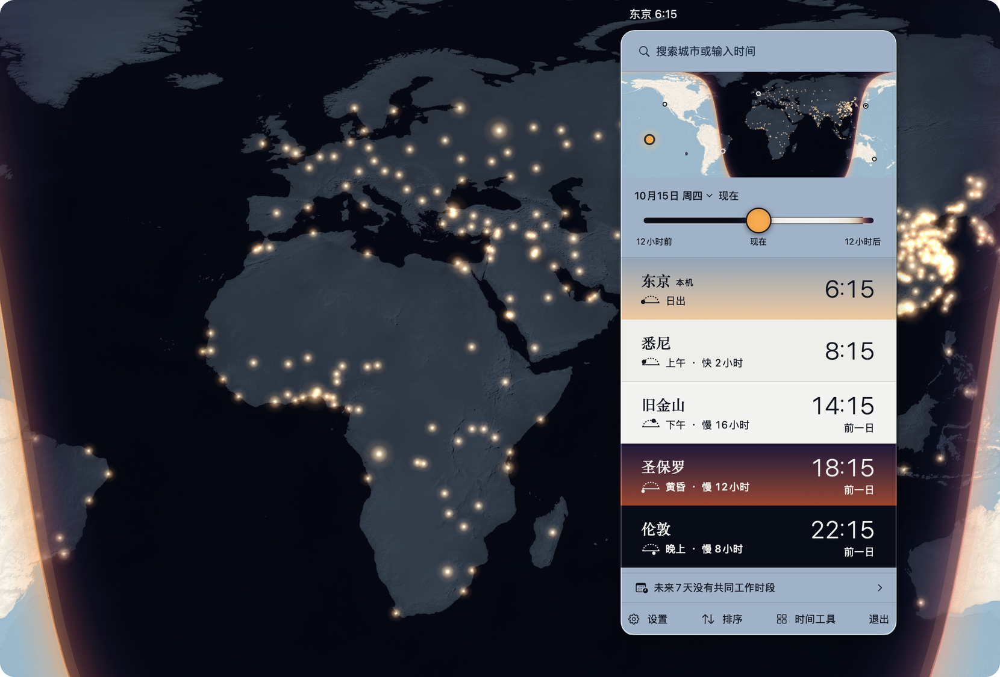

# Dayside

[English](README.md) · 简体中文

给东京的朋友发消息之前，先看一眼他那边的天吧。



Dayside 是一个住在 Mac 菜单栏里的世界时钟。你加的每个地方占一行，这一行涂的就是那里此刻真实的天色：深夜是暗色，白昼是亮色，破晓带一点玫瑰色，黄昏偏琥珀。谁在睡觉一眼就能看出来了。

跨时区沟通有太多反复踩的坑，我做 Dayside 就是要一次解决。时差、对方醒没醒、怎么排会议不让人熬夜、夏令时什么时候换，全交给它算。

## 长什么样

点一下菜单栏里的钟，面板就打开了。最上面是一张世界地图，太阳此刻照亮的那半个地球是亮的，昼夜交界的那条线也画在上面。下面每个地方一行，写着当地几点、比你这边快还是慢几个小时，底色就是那里的天。搜索框除了搜城市，也读得懂象（明天 9:00 东京）这样的自然语言。

时间可以拖动：拖地图或者拖时间滑块，太阳、昼夜线和所有的钟会一起走。连按两下地图，会打开一个大大的地球窗——你的地点都标在上面，写着当地几点，夜里那半边还亮着大城市的灯火（人口够多的城市才有资格亮灯），也能全屏。

它没有程序坞图标，就安安静静待在菜单栏里。

## 能拿它做什么

- 菜单栏里放一到六个钟，显示地名、缩写或者 UTC 偏移皆可。
- 离线搜城市。各种语言的本地名、NYC、HK 这样的城市简称、UK 这样的国名都搜得到，按时区偏移搜也行；日出日落按每座城市自己的经纬度算。
- 十六种语言写的日期、钟点、地点和时区，Dayside 都能从一整段文字里认出来。把聊天记录或邮件粘进来，有歧义的时间两种读法都摆出来让你选，不成立的时间直接指出。
- 找碰头时间，找一个大家都方便的时刻。例会还能轮着开，免得每次都是同一拨人熬夜。排好了直接加进日历。
- 「时间工具」窗口里还有日历、人物时钟、时间换算、计时器、夏令时提醒、太阳与月亮、市场时钟、旅行和分享我的时间。每一页都是你打开它的时候才加载。
- 也可以从快捷指令、聚焦搜索、服务菜单（「使用Dayside换算时间」）或者全局快捷键（默认关着的）叫它出来。

读时间这件事全在你的 Mac 上跑，用的是 Rust 写的固定规则，同一段话永远读出同一个答案（不靠猜）。夏令时跳过的那一小时、重复的那一小时，都按系统自己的时区规则来算。

界面有十六种语言：英语、简体中文、繁体中文、日语、韩语、德语、西班牙语、法语、俄语、葡萄牙语、意大利语、荷兰语、波兰语、土耳其语、越南语和印尼语。城市名可以用和界面不一样的语言。

## 安装

需要 macOS 26 或更新版本。安装包有两个，在 [Releases](https://github.com/ninondev/Dayside/releases) 页面下载。

- 文件名以 `-arm64.dmg` 结尾的，给 Apple 芯片的 Mac。
- 以 `-x86_64.dmg` 结尾的，给 Intel Mac。这个我只在 Apple 芯片 Mac 的 Rosetta 下验过，还没在真的 Intel Mac 上跑过。你的 Mac 是 Apple 芯片的话，必须用 arm64 那个。

打开磁盘映像，把 Dayside.app 拖进「应用程序」。

这一版是 ad-hoc 签名，没有经过苹果公证，所以第一次打开会被系统拦下来。到「系统设置 › 隐私与安全性」，拉到最下面，点「仍要打开」，再输入密码确认，就能打开了。

版本号在 App 的「设置 › 帮助」里。

## 隐私

没有账号，没有遥测，也没有广告。正式构建没有联网权限，App 自己不发任何网络请求。你点的网页链接会在别的 App 里打开，那个 App 可能会联网。

地点、设置和存下来的记录都只在你这台 Mac 上。日历和通讯录要你点了允许才会读，通讯录它也不会改。诊断日志和崩溃报告同样留在本机。诊断报告可以自己导出，发给别人之前先看一眼吧，里面有你存的地点。

报告安全或隐私问题，请看 [SECURITY.md](SECURITY.md)。

## 从源码构建

需要 macOS 26 或更新版本、Xcode 27、Rust 1.85 或更新版本、Python 3，以及你要构建的架构对应的 Rust Apple target。Cargo 依赖固定在 `RustCore/Cargo.lock` 里。下面的命令都离线跑，所以这些依赖要事先在本机的 Cargo 缓存里。

Xcode 工程、target、scheme 和 Swift 模块还用着项目最早的名字 TahoeTime，构建出来的 App 是 `Dayside.app`。

在 `RustCore/` 里运行：

```sh
cargo test --locked --offline -j 3 --all-targets
cargo test --locked --offline -j 3 --release --lib
cargo test --locked --offline -j 3 --lib --features intents-only
cargo clippy --locked --offline -j 3 --all-targets -- -D warnings
```

在仓库根目录检查许可证头、本地化目录和分享页：

```sh
python3 Tools/spdx_headers.py --check
python3 Tools/l10n_check.py --check
node Tools/site_tests/when_test.mjs
```

本地化检查不用构建，就能核对源码引用和全部十六种译文。有编译器提取的字串时，它也会一起核对，并报出核对的范围。Node 只有分享页测试要用。

只编译 Mac App 和它的测试包、不运行的话，先把 `DAYSIDE_DERIVED_DATA` 设成一个构建输出目录，再在仓库根目录运行：

```sh
xcodebuild -project TahoeTime.xcodeproj -scheme TahoeTime -configuration Debug \
  -destination 'platform=macOS,arch=arm64' -derivedDataPath "$DAYSIDE_DERIVED_DATA" \
  -jobs 3 CODE_SIGNING_ALLOWED=NO build-for-testing
```

`DaysideCore` 会先运行 `Tools/build_rust_core.sh` 生成 Rust 静态库，再编译 Swift。`Tools/sign_bundle.sh` 给本地构建做 ad-hoc 签名，所以不需要开发者账号。正式发布的安装包由 `Tools/release_sign_notarize.sh` 用 Developer ID 重签并公证。`Tools/verify_all.sh` 还会跑 Swift 测试，这些测试以 App 作为宿主启动。构建成功不代表 Swift 测试和 App 里的交互都能通过。

代码按目录分开放。

- `RustCore/`：规则、城市索引、搜索、读时间、天文、排程、绘图几何和存储。详见 [RustCore/README.zh-Hans.md](RustCore/README.zh-Hans.md)。
- `TahoeTime/` 和 `Shared/`：SwiftUI 视图和 Apple 框架的接入。
- `TahoeTimeTests/`、`TahoeTimeUITests/` 和 `RustCore/tests/`：测试和测试数据。
- `DaysideiOS/`：和 Mac 共用 Rust 核心的 iPhone 原型，功能少一些。
- `Tools/`：构建、测试、打包、测量和生成数据的工具。
- `site/`：分享时间名片用的网页，还有隐私与支持页的草稿。

## 地名

城市和行政区名来自 GeoNames 与 Wikidata，缺少译名时用记录里的原名。

## 已知问题

1. 各语言的翻译和校对还没请母语者看过，哪里不对欢迎来提。
2. 每一页的自动化无障碍检查都过了，但完整的 VoiceOver 手动走查还没做。
3. 市场时钟收了上海和香港 2026 年的官方休市日。别的年份走通用规则，调休之类的临时安排可能会漏掉。半日交易没有显示。
4. 地球窗和少数几页比之前多吃了一些内存，1.0.1 打算压下去。
5. 时区规则用的是 macOS 自带的数据。这台 Mac 的数据要是比已知的规则变更旧，Dayside 会提醒。

反馈走 [GitHub Issues](https://github.com/ninondev/Dayside/issues)。

## 许可

Dayside 是自由软件，采用 GPL-3.0-only。所有功能都免费，Dayside 永远不会出售。见 [LICENSE](LICENSE) 和 [COPYING](COPYING)。

## 数据来源与致谢

- 城市数据：[GeoNames](https://www.geonames.org)，CC BY 4.0。
- 地名标签：[Wikidata](https://www.wikidata.org)，CC0。
- 地图地形：[Natural Earth](https://www.naturalearthdata.com)，公有领域。
- 时区规则：macOS 自带的 IANA 时区数据库，运行时读取。
- 一天里各时段的叫法：Unicode CLDR，Unicode License v3。
- 中文界面欢迎页上那幅「天涯共此时」毛笔草书，字形取自 Liu Jian Mao Cao，SIL Open Font License 1.1。题记出自唐代张九龄和 John Muir。

详细说明见 [THIRD_PARTY_NOTICES.md](THIRD_PARTY_NOTICES.md)；随包 Rust crate 的声明在 `TahoeTime/Resources/ThirdPartyNotices.txt`。
